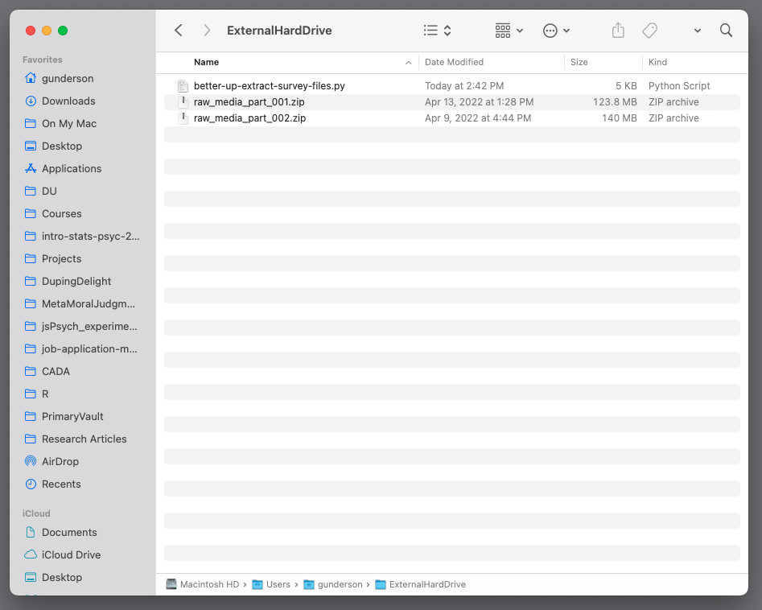

```{r setup, include=FALSE}
knitr::opts_chunk$set(echo = TRUE)
```

Data to be extracted from:   
**Advancing an Interdisciplinary Science of Conversation: Insights from a Large Multimodal Corpus of Human Speech**


## Goals

In each `.zip` file, there are several `survey.csv` files. The goal is to extract only those `.csv` files from each of the `.zip` files and then compile them into one `.csv` file. Each of the `.zip` files should contain 10 `survey.csv` files. 

1. Look for `survey.csv` in each of the `.zip` files.
2. Append directory name to each of the `survey.csv` files so it is `directory-name-survey.csv`.
3. Put all of the `directory-name-survey.csv` files into a new directory, `survey_files`.
4. Merge all `directory-name-survey.csv` files into one `compiled-survey.csv` file and separate it so it is in a new directory called `compiled_survey`.\

## Preliminaries: Update python and install pandas

In the terminal, run the following commands sequentially:

1. `brew install python` (probably takes 40-50 seconds)
2. `python3 --version` Should be `Python 3.10.4`
3. `pip3 install --upgrade pip`
4. `pip3 --version` Should be `pip 22.0.4`
5. `pip3 install pandas` This is a data analysis package for python
6. `pip3 show pandas` Should be `Version: 1.4.2`

Now everything is up-to-date and we can run the script below without error.

## Add script to correct folder

Add the `better-up-extract-survey-files.py` to the folder where all of the `.zip` files are, like shown below:



## Use the terminal to go to the external hard drive

If the files are all on an external hard drive, enter the following commands sequentially:

1. `cd \` This is to change directory to where the external devices will be.
2. `cd Volumes` This is to change directory to where your external hard drive will be.
3. `ls` will list all of your connected devices, including external hard drives.
3. `cd HARDDRIVENAME` substitute the correct name for HARDDRIVENAME.
4. `ls` to list all the files. Make sure it lists all the `.zip` files and `better-up-extract-survey-files.py` like the example below.

 

## Run the python script

In the terminal, type:
`python3 better-up-extract-survey-files.py`

 

## Check the terminal output
If all goes well, you should see output in the terminal that looks like this:

 

## Check new folders on the external hard drive

If all went according to plan, you should see two new folders, `survey_files` and `compiled_survey`. 


### survey_files folder

The `survey_files` folder contains all of the individual `survey.csv` files extracted from each of the zip files. To present confusion, they were renamed by appending their directory name in front, like `directory-name-survey.csv`.  

For instance, one file is named `5f968cf3-3b7f-4aef-9952-6be9e9f31db9_survey.csv`.


### compiled_survey folder

The `compiled_survey` folder should have one file called `compiled_survey_data.csv`. This is the compilation of **all** the surveys into one `.csv` file.


When you open `compiled_survey_data.csv`, it should look similar to:


---

That should be it! You can now run whatever analyses you would like with the `compiled_survey_data.csv` file!  :)

#### A few notes

I don't know how long it will take, but you should be getting the following output in this order:

1. List of all .zip files in the folder
2. All .csv files were extracted successfully to temp_survey folder
3. All files below were created:
4. Copying all survey files into survey_files directory: 
5. compiled_survey_data.csv file is now created.
6. temp_survey folder is now deleted.
7. Success! compiled_survey_data.csv can be found in the compiled_survey folder. Individual surveys can be found in the survey_files folder.

I don't know how many total `.zip` files are in the set. Based on the two `.zip` files I had, each contained 10 `.csv` files.

To find out how many `.zip` files there are in the folder, type this command in the terminal (assuming you are still in the folder with all the `.zip` files):  

`ls -lR *.zip | wc -l`

This should output a number (e.g., 200).

Each `.zip` file has 10 `directory-name-survey.csv` files, and each of those survey files has two rows of data. So:  

200 zip files * 10 survey files * two rows of data = 4,000 rows of data in the `compiled_survey_data.csv` file.

---
